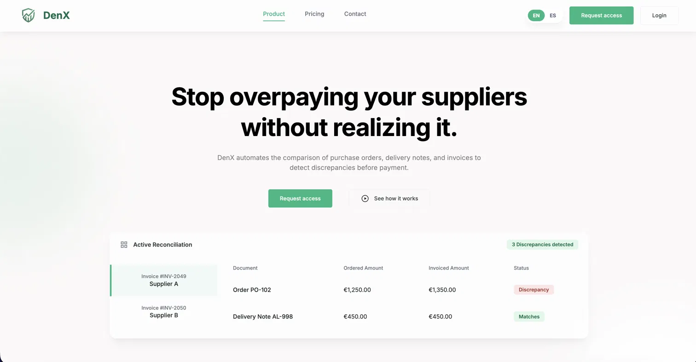
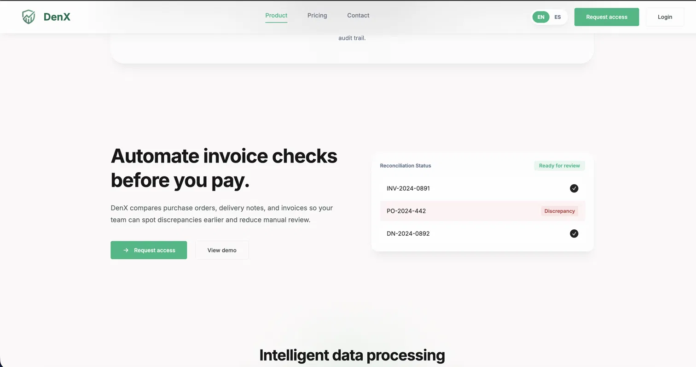
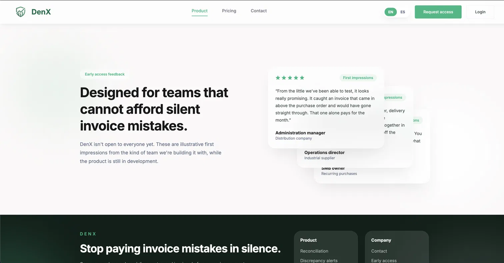
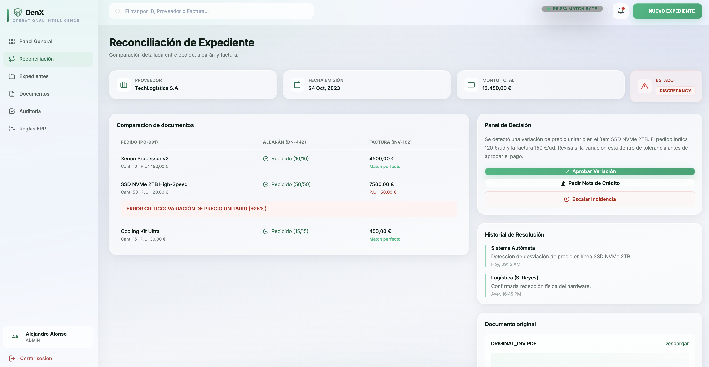
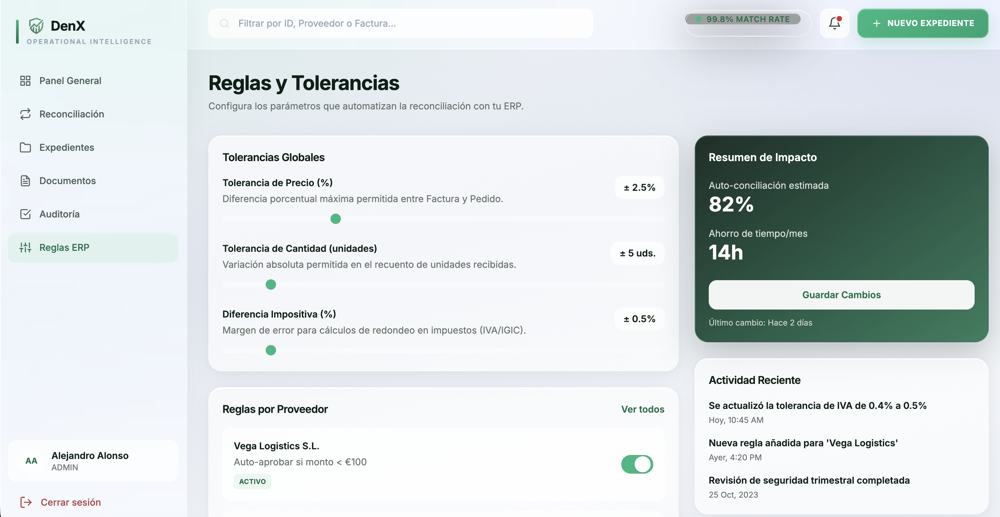
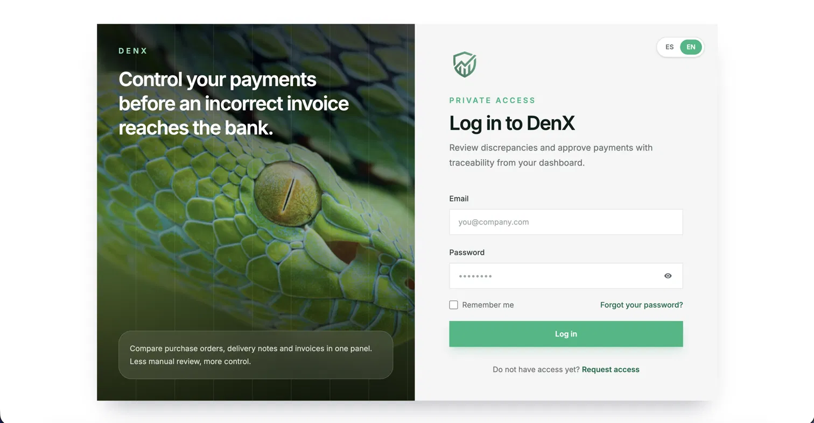

# DenX ALPHA 

> **Stop overpaying your suppliers without realizing it.**

DenX is a financial reconciliation SaaS. It automatically compares **purchase orders, delivery notes, and invoices**, flags any mismatch, and gives your team a clear decision *before* a wrong payment ever reaches the bank.


---

## 🔍 Sneak peek

> The landing page ships in English/Spanish. The in-app screenshots below are from the Spanish workspace.

**Landing — the pitch**

<p align="center">
  
  
  
</p>

**Catching a discrepancy in real time** — three-way match across order, delivery note, and invoice. Here DenX flags a **+25% unit-price variation** and hands the reviewer a decision panel: approve the variance, request a credit note, or escalate.

<p align="center"> 
  
</p>

<table>
  <tr>
    <td width="50%" valign="top">
      
      <br><sub><b>Rules &amp; tolerances</b> — set price %, quantity, and tax thresholds, plus per-supplier auto-approval rules.</sub>
    </td>
    <td width="50%" valign="top">
      
      <br><sub><b>Private access</b> — invite-only login for early-access teams.</sub>
    </td>
  </tr>
</table>

---

## ✨ Features

- **Three-way matching** — reconciles purchase order ↔ delivery note ↔ invoice automatically.
- **Discrepancy detection** — catches unit-price variations, quantity mismatches, and tax rounding errors before payment.
- **Configurable tolerances** — global thresholds for price (%), quantity (units), and tax difference (%), tuned with live sliders.
- **Per-supplier rules** — e.g. auto-approve under €100, or always require a manual audit.
- **Decision panel** — approve a variance, request a credit note, or escalate an incident, with full context.
- **Audit trail** — resolution history and activity log for every file.
- **ERP sync** — rules and results sync to your ERP, encrypted end-to-end.
- **Impact summary** — estimated auto-reconciliation rate and time saved per month.
- **Bilingual UI** — English / Spanish.

---

## ⚙️ How reconciliation works

1. **Ingest** the three documents for a file: purchase order, delivery note, and invoice.
2. **Match** line by line — quantities, unit prices, totals, and taxes.
3. **Flag** anything outside the configured tolerances as a discrepancy.
4. **Decide** from the review panel: approve, request a credit note, or escalate.
5. **Sync** the outcome to your ERP with a full audit trail.

---

## 🛠️ Tech stack

| Layer     | Tech     |
| --------- | -------- |
| Frontend  | React    |
| Backend   | Node.js  |
| ORM       | Prisma   |
| Database  | MySQL    |

---

## 🚀 Getting started

```bash
# 1. Clone
git clone https://github.com/<your-username>/denx.git
cd denx

# 2. Install dependencies
npm install

# 3. Configure environment
cp .env.example .env
# set DATABASE_URL and any auth / ERP keys

# 4. Set up the database
npx prisma migrate dev

# 5. Run in development
npm run dev
```

> Adjust the scripts and folder layout to match your setup (for example, separate `client/` and `server/` packages).

---

## 🔒 Status

DenX is in **private / early access** and under active development. The testimonials shown in-product are illustrative first impressions from the design-partner teams it's being built with.
